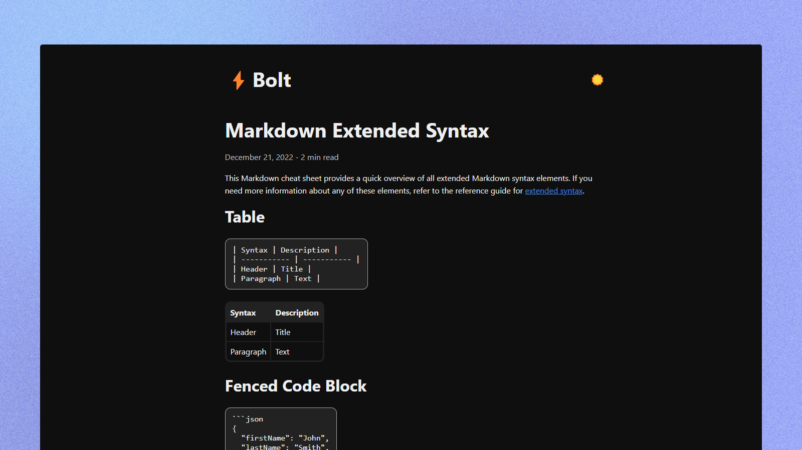

<p align="center">
  <br/>
  Bolt is a minimal blog theme based on <a href="https://github.com/tbolt/boltcss">Bolt.css</a> and  built on <a href="https://thulite.io/">Thulite</a> &mdash;
  <br/>
  the all-in-one Hugo-npm framework.
  <br/><br/>
</p>

## Demo

- [bolt.thulite.io](https://bolt.thulite.io/)

## Features

- Minimal layout
- HTML elements styling based on [Bolt.css](https://boltcss.com/)
- Dark mode toggle based on [The Complete Guide to the Dark Mode Toggle](https://ryanfeigenbaum.com/dark-mode/)
- Tags
- Reading time
- Related posts
- CSS custom properties (variables)

## Prerequisites

- [Hugo](https://github.com/gohugoio/hugo/releases/latest) (latest extended or extended/deploy edition)
- [Dart Sass](https://github.com/sass/dart-sass/releases/latest) (latest version)
- [Node.js/npm](https://nodejs.org/en/download) (latest LTS version)

## Installation

The **recommended** way to install the latest version of Bolt is by running the command below:

```bash
npm create thulite@latest -- --template bolt
```

Looking for help? Start with our [Installation](https://docs.thulite.io/thulite/start-here/installation/) guide.

## Documentation

Visit our [official documentation](https://docs.thulite.io).

## Support

Having trouble? Get help in the official [Thulite Discussions](https://github.com/orgs/thuliteio/discussions).

## Links

- [License (MIT)](LICENSE)
- [Code of Conduct](https://github.com/thuliteio/.github/blob/main/CODE_OF_CONDUCT.md)
- [Project Funding](https://github.com/thuliteio/.github/blob/main/FUNDING.md)
- [Website](https://thulite.io/)

## Sponsoring

Help keep Thulite sustainable by supporting maintenance, documentation, and long-term development.

[Sponsor Thulite](https://github.com/sponsors/thuliteio) ❤️
